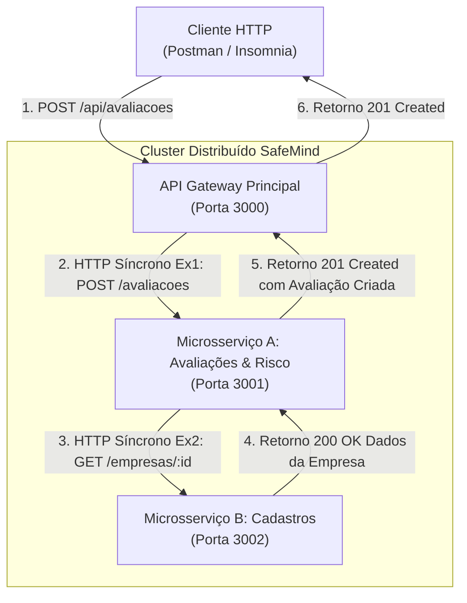

# SafeMind Distributed — Sistema Distribuído de Avaliação Psicossocial (Entrega 2)

**Disciplina:** Desenvolvimento de Sistemas Distribuídos  

---

## 1. Visão Geral da Arquitetura Distribuída

O projeto SafeMind Distributed é uma solução distribuída em **Node.js + TypeScript** desenhada para gestão e avaliação de riscos psicossociais e conformidade com as diretrizes da **NR-1 (PGR)**.

Para atender plenamente aos requisitos da Entrega 2, o sistema opera com **3 serviços desacoplados** rodando em portas distintas na mesma rede, orquestrando fluxos síncronos de dados via protocolo HTTP:



---

## 2. Responsabilidades dos Serviços

| Serviço | Porta | Responsabilidade | Camadas Implementadas |
| :--- | :---: | :--- | :--- |
| **API Gateway** | `3000` | Ponto de entrada unificado, roteamento transparente, monitoramento de saúde do cluster. | Controllers, DTOs, Routes |
| **Microsserviço A** | `3001` | Gestão de avaliações, questionários, cálculo psicossocial NR-1 e relatórios. | Controllers, DTOs, Services, Repositories, Models |
| **Microsserviço B** | `3002` | Cadastro e consulta de Empresas e Colaboradores. | Controllers, DTOs, Services, Repositories, Models |

---

## 3. Padrão Obrigatório de 5 Camadas

Cada microsserviço de negócio segue rigorosamente a separação de responsabilidades em 5 camadas:

```
src/
├── controllers/    # Recebe HTTP, valida DTOs, delega ao Service e define status HTTP
├── dtos/           # Schemas de validação Zod e tipagem TypeScript para entradas e saídas
├── services/       # Regras de negócio, cálculos matemáticos e chamadas de rede síncronas
├── repositories/   # Interfaces e implementações isoladas de persistência
└── models/         # Entidades de domínio centrais
```

---

## 4. Como Executar o Sistema

### Pré-requisitos
* Node.js v18+ (recomendado v20+)
* npm v9+

### Passo 1: Instalar Dependências
Na raiz do projeto (`SafeMind Distribuido`), execute:
```bash
npm install
```

### Passo 2: Iniciar os 3 Serviços Simultaneamente
Execute o comando único de inicialização:
```bash
npm run dev
```

Você verá no console as saídas coloridas dos três serviços subindo juntos:
*  **API Gateway**: `http://localhost:3000`
*  **Microsserviço A (Avaliações)**: `http://localhost:3001`
*  **Microsserviço B (Cadastros)**: `http://localhost:3002`

---

## 5. Persistência de Dados (SQLite)

O projeto adota o padrão **Database-per-Service** para garantir o total desacoplamento e autonomia dos microsserviços:

* **Microsserviço B (Cadastros):** Persiste em `servico-cadastros/data/cadastros.db` (tabelas `empresas` e `colaboradores`).
* **Microsserviço A (Avaliações):** Persiste em `servico-avaliacoes/data/avaliacoes.db` (tabelas `avaliacoes` e `respostas_questionario`).

Os bancos de dados criam suas tabelas e aplicam seeds iniciais de teste automaticamente na primeira inicialização.

---

* **Arquitetura:** Microsserviços Distribuídos com Comunicação Síncrona REST
* **Banco de Dados:** SQLite (Database-per-Service via better-sqlite3)
* **Linguagem:** TypeScript / Node.js

