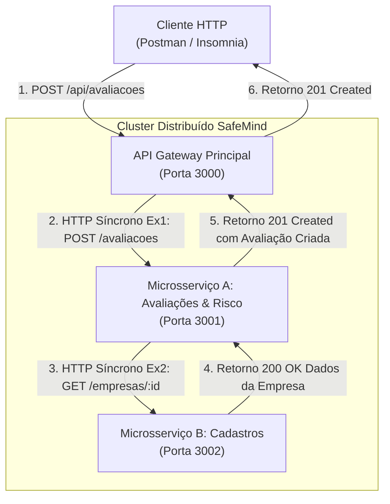

# SafeMind Distributed — Sistema Distribuído de Avaliação Psicossocial (Entrega 2)

**Disciplina:** Desenvolvimento de Sistemas Distribuídos  
**Prazo de Entrega:** 08/10/26 até às 18:59h  
**Tempo de Apresentação:** 15 minutos (Demonstração prática via Postman)

---

## 1. Visão Geral da Arquitetura Distribuída

O projeto SafeMind Distributed é uma solução distribuída em **Node.js + TypeScript** desenhada para gestão e avaliação de riscos psicossociais e conformidade com as diretrizes da **NR-1 (PGR)**.

Para atender plenamente aos requisitos da Entrega 2, o sistema opera com **3 serviços desacoplados** rodando em portas distintas na mesma rede, orquestrando fluxos síncronos de dados via protocolo HTTP:



---

## 2. Responsabilidades dos Serviços

| Serviço | Porta | Responsabilidade | Camadas Implementadas |
| :--- | :---: | :--- | :--- |
| **API Gateway** | `3000` | Ponto de entrada unificado, roteamento transparente, monitoramento de saúde do cluster. | Controllers, DTOs, Routes |
| **Microsserviço A** | `3001` | Gestão de avaliações, questionários, cálculo psicossocial NR-1 e relatórios. | Controllers, DTOs, Services, Repositories, Models |
| **Microsserviço B** | `3002` | Cadastro e consulta de Empresas e Colaboradores. | Controllers, DTOs, Services, Repositories, Models |

---

## 3. Padrão Obrigatório de 5 Camadas

Cada microsserviço de negócio segue rigorosamente a separação de responsabilidades em 5 camadas:

```
src/
├── controllers/    # Recebe HTTP, valida DTOs, delega ao Service e define status HTTP
├── dtos/           # Schemas de validação Zod e tipagem TypeScript para entradas e saídas
├── services/       # Regras de negócio, cálculos matemáticos e chamadas de rede síncronas
├── repositories/   # Interfaces e implementações isoladas de persistência
└── models/         # Entidades de domínio centrais
```

---

## 4. Como Executar o Sistema

### Pré-requisitos
* Node.js v18+ (recomendado v20+)
* npm v9+

### Passo 1: Instalar Dependências
Na raiz do projeto (`SafeMind Distribuido`), execute:
```bash
npm install
```

### Passo 2: Iniciar os 3 Serviços Simultaneamente
Execute o comando único de inicialização:
```bash
npm run dev
```

Você verá no console as saídas coloridas dos três serviços subindo juntos:
* 🌐 **API Gateway**: `http://localhost:3000`
* 🚀 **Microsserviço A (Avaliações)**: `http://localhost:3001`
* 🚀 **Microsserviço B (Cadastros)**: `http://localhost:3002`

---

## 5. Roteiro de Demonstração no Postman (15 Minutos)

Importe o arquivo [`postman/SafeMind_Entrega2.postman_collection.json`](./postman/SafeMind_Entrega2.postman_collection.json) no Postman ou Insomnia e siga a sequência:

### Roteiro Sequencial:

1. **`0. Status do Cluster Distribuído` (`GET http://localhost:3000/api/status-distribuido`)**
   * *O que mostra:* O Gateway faz ping de saúde em tempo real nos serviços A e B e retorna a topologia com status `ONLINE`.

2. **`1. Cadastrar Nova Empresa` (`POST http://localhost:3000/api/empresas`)**
   * *O que mostra:* Cadastro de empresa através do Gateway chegando ao Microsserviço B.

3. **`2. Consultar Empresa por ID` (`GET http://localhost:3000/api/empresas/emp-1`)**
   * *O que mostra:* Consulta direta dos dados cadastrados e confirmação de situação `ativa: true`.

4. **`3. Cadastrar Colaborador` (`POST http://localhost:3000/api/colaboradores`)**
   * *O que mostra:* Vinculação de colaborador a uma empresa válida.

5. **`4. [PROVA SÍNCRONA Ex1 + Ex2] Criar Avaliação Psicossocial` (`POST http://localhost:3000/api/avaliacoes`)**
   * *O que comprova:*
     * O cliente chama o Gateway na porta `3000` (**Ex1**).
     * O Gateway chama o Serviço A na porta `3001`.
     * O Serviço A faz chamada síncrona ao Serviço B na porta `3002` (**Ex2**) para validar se a empresa existe e está ativa antes de salvar.
     * Os logs no terminal ilustram detalhadamente a cascata de requisições e respostas.

6. **`5. [PROVA SÍNCRONA Negativa] Tentativa com Empresa Inexistente`**
   * *O que comprova:* Envia `empresaId: "empresa-fantasma-999"`. O Serviço A consulta o Serviço B, constata o erro 404 e rejeita a requisição, provando que a integridade entre os nós é garantida síncronamente em tempo real.

7. **`6. Submeter Resposta de Questionário NR-1 (Colaborador 1 - Risco Baixo)`**
   * *O que mostra:* Submissão de respostas psicossociais. O Serviço A calcula as médias ponderadas e classifica o nível de risco.

8. **`7. Submeter Resposta de Questionário NR-1 (Colaborador 2 - Risco Alto)`**
   * *O que mostra:* Envio de respostas com estressores ocupacionais elevados, acionando o recálculo dinâmico da avaliação.

9. **`8. Obter Relatório Consolidado de Risco Psicossocial` (`GET http://localhost:3000/api/avaliacoes/{{avaliacaoId}}/relatorio`)**
   * *O que mostra:* Retorna as métricas agregadas da avaliação, contagem de respondentes e matriz de distribuição de risco (Baixo, Médio, Alto, Crítico).

---

## 6. Autores e Informações do Projeto
* **SafeMind Team**
* **Arquitetura:** Microsserviços Distribuídos com Comunicação Síncrona REST
* **Linguagem:** TypeScript / Node.js
